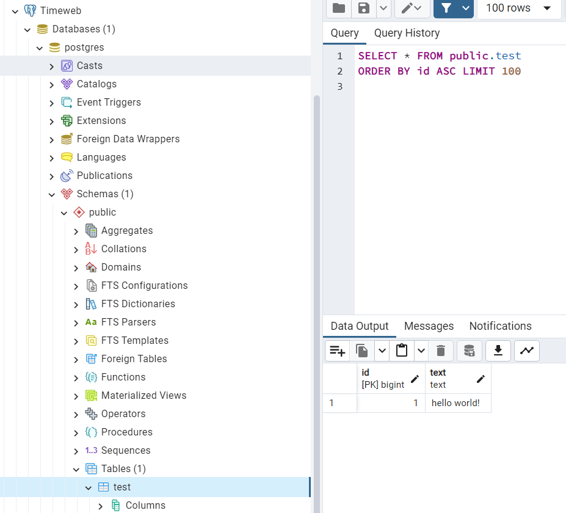
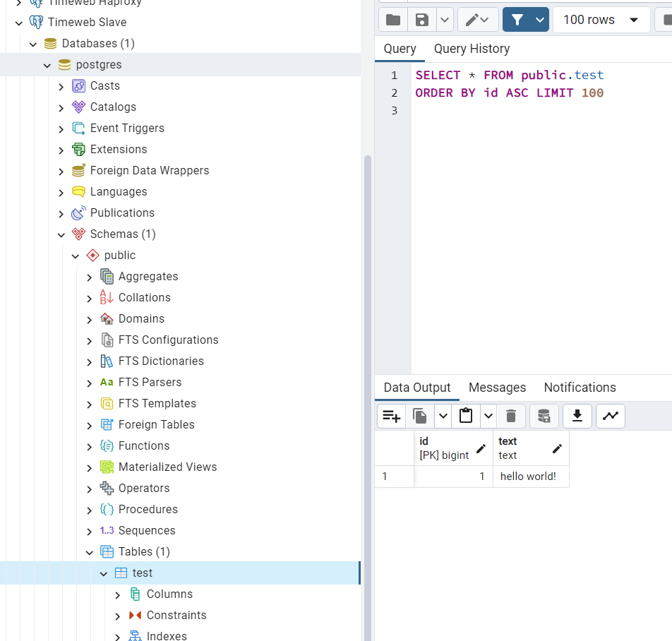
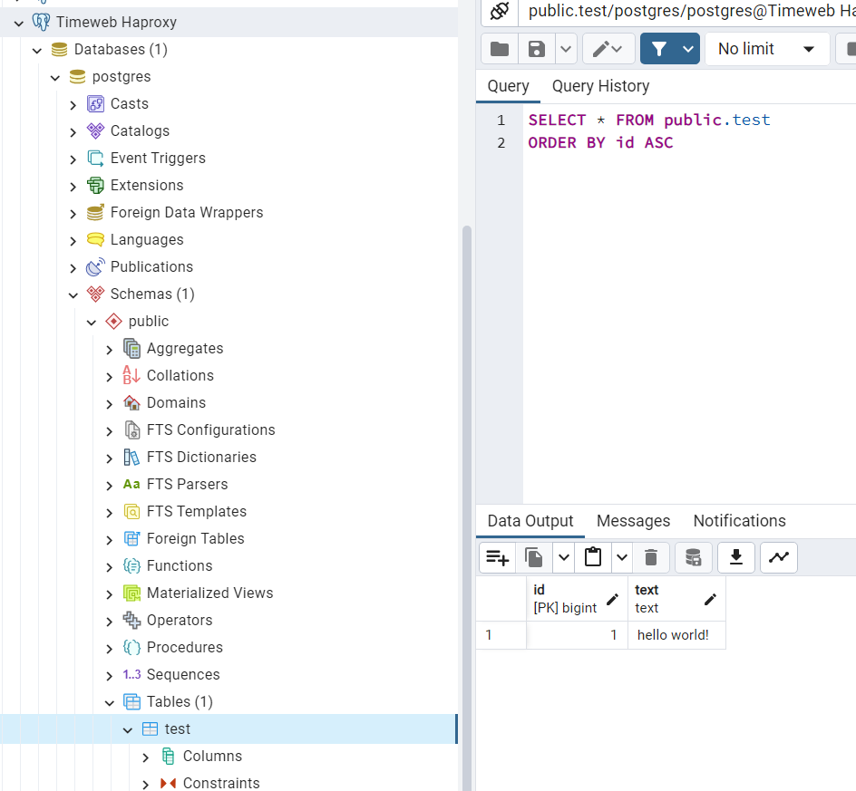
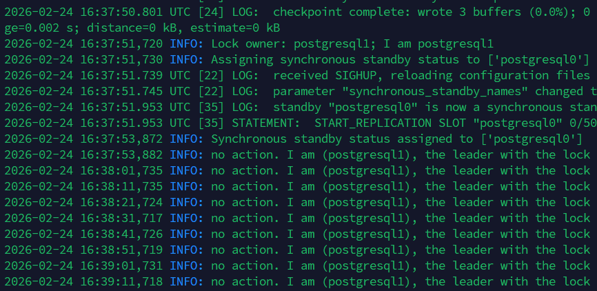
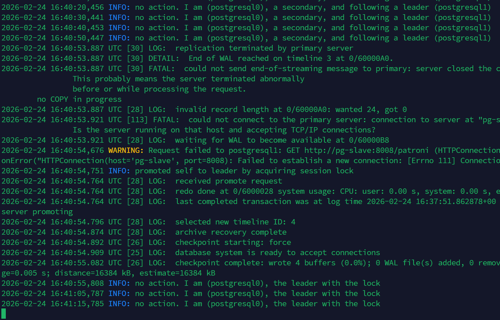

# Лабораторная работа 1. HA Postgres Cluster

## Что делал

По инструкции настроил все файлики через vim на удаленном сервере, они приложены в ./files

Сначала запустил pg-slave + pg-master + zoo, подключился через pgadmin к обоим и проверил, что таблицы и данные синкаются

Потом настроил haproxy и подключился к главному серверу по порту 5432, в нем так же убедился в засинкованных данных

Потом пошел пробовать отключать master ноду, кстати забавно pg-slave ей и стала, потому что включилась быстрее

`docker logs pg-slave | grep leader`

`docker stop pg-slave` &&
`docker logs -f pg-master`

Мастер нода упала, но второй инстанс взял на себя роль мастера и продолжила функционировать

## Ответы на вопросы

### 1. Порты 8008 и 5432 вынесены в разные директивы - `expose` и `ports`. В чём разница?

`expose` открывает порт только внутри docker-сети (между контейнерами). Контейнер становится доступен по этому порту для других сервисов в том же compose-проекте, но с хост-машины достучаться до него нельзя

`ports` пробрасывает порт на хост-машину. Порт становится доступен и снаружи (с хоста), и внутри docker сети

### 2. При обычном перезапуске compose-проекта будет ли пересобран образ?

Нет. При `docker compose up -d` Docker Compose не пересобирает образы автоматически. Он использует уже существующий закэшированный образ `localhost/postres:patroni`

Если отредактировать `postgresN.yml` образ всё равно не будет пересобран при обычном `docker compose up -d`, потому что Compose не отслеживает изменения в файлах, участвующих в сборке (build context). Однако, если явно запустить пересборку через `docker compose up -d --build`, Docker выполнит сборку
