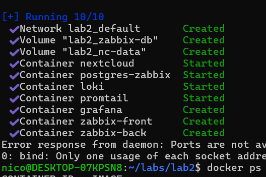
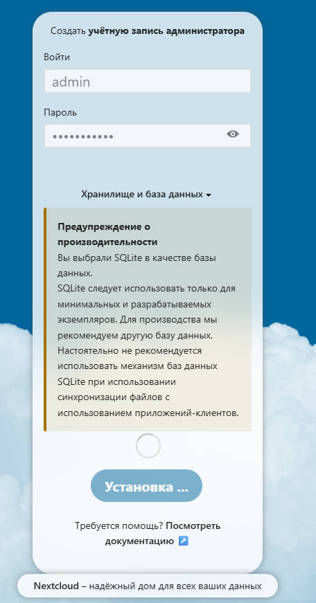
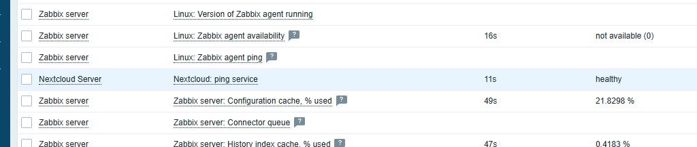
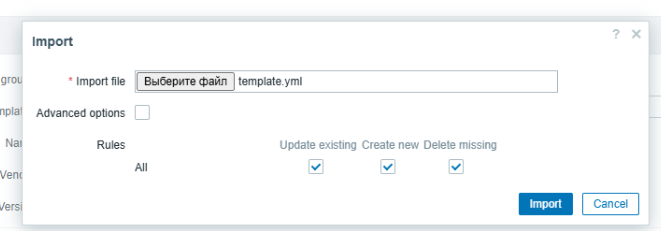
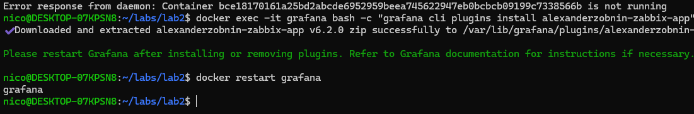
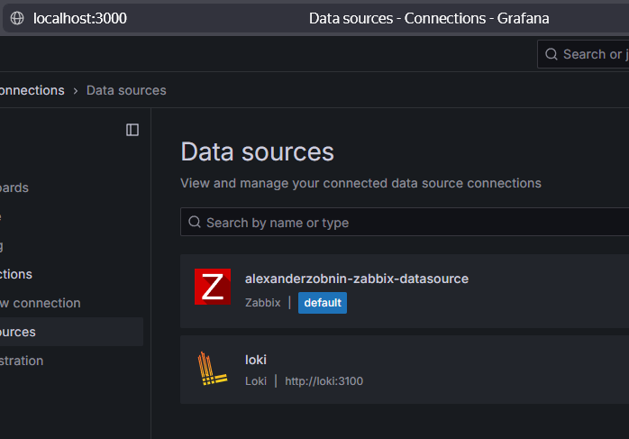
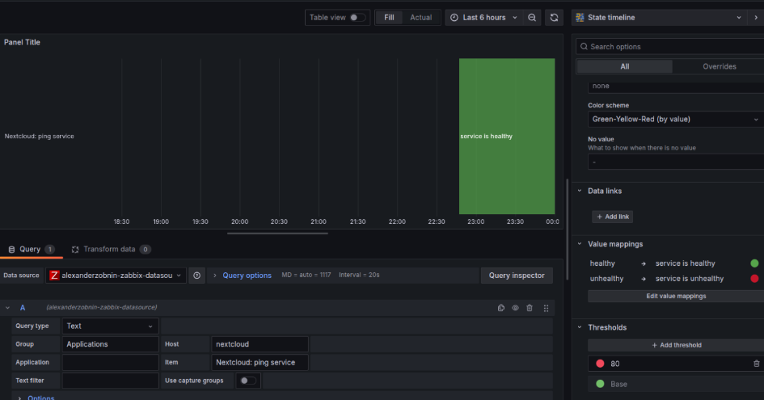
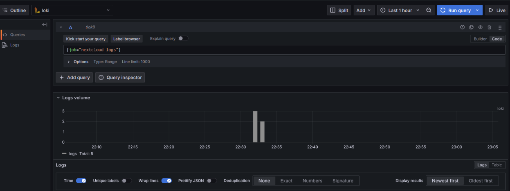

# Лабораторная работа 2. Loki + Zabbix + Grafana

Эту лабу начинал делать на удаленной VDS, но 10гб диска не хватило и вот я на локальной WSL без работающего впн, ждал пока сервер
ребутнут((

Создал все конфиги, их можно в папке files/ этого репозитория глянуть. Поднял docker-compose и пошел инициализировать Nextcloud

 

Дальше настраивал Zabbix по адресу `localhost:8002`. Импортировал темплейт для мониторинга, потом получил healthy статус от pong
service, который мы и импортировали

 

Дальше установил графаню и подключил Zabbix + Loki

 

И сам дашборд

 

## Вопросы

1. SLA - обещание клиенту, SLO - внутренняя метрика качества

2. Инкрементальный бекап сохраняет изменения с прошлого бекапа, а дифференциальный - все изменения с последнего полного бекапа

3. Мониторинг показывает заранее прописанные метрики/алерты, когда observability это поиск новых проблемных точек по логам/трейсам
