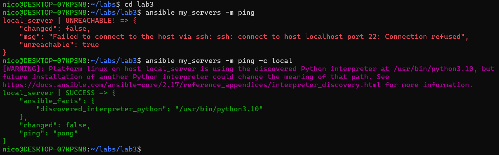
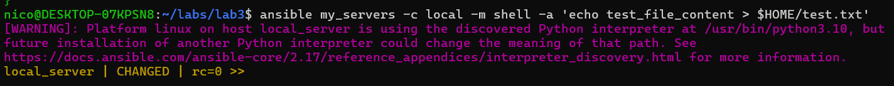
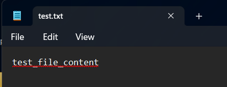
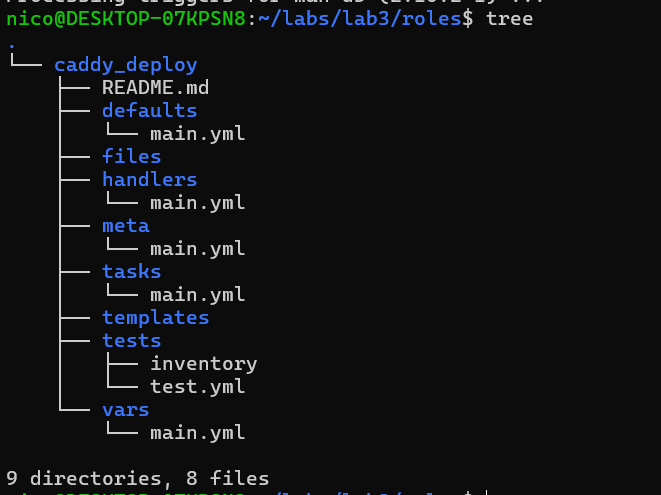
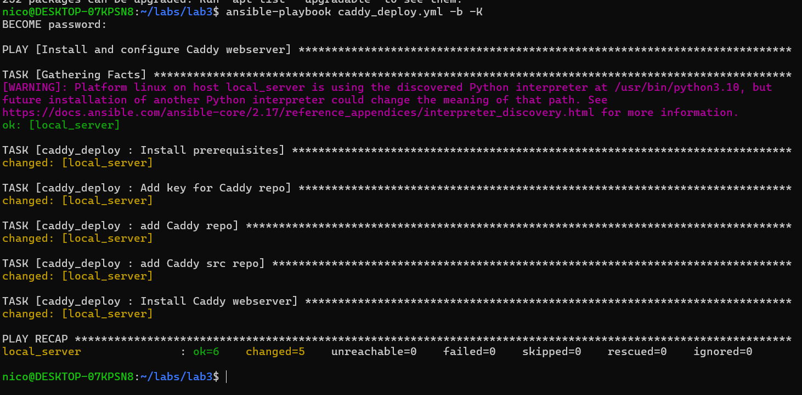
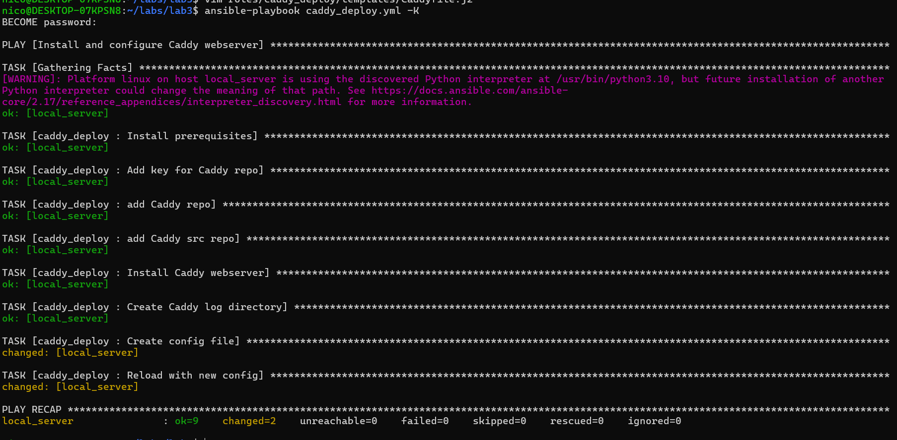
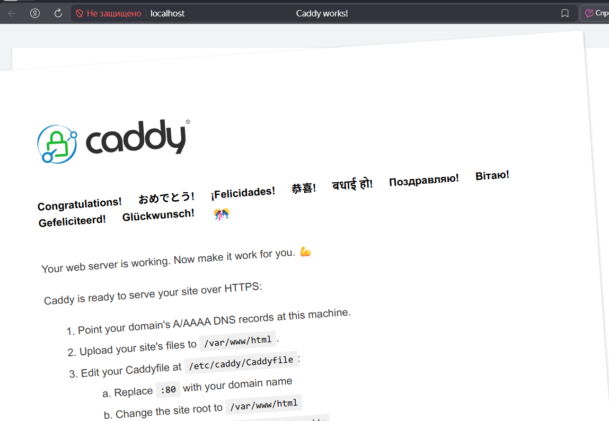
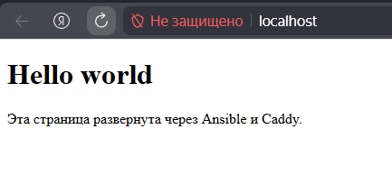
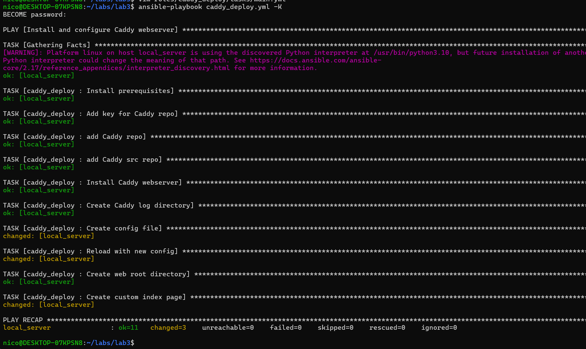
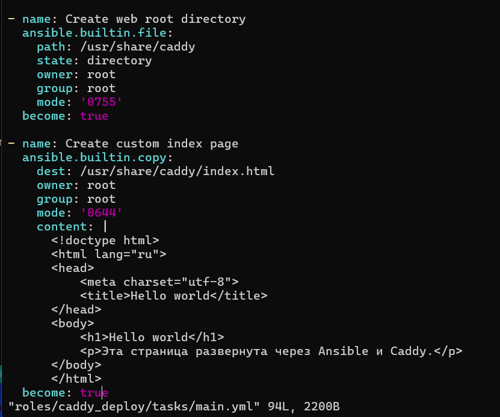

# Лабораторная работа 3. Ansible + Caddy

## Что делал

По инструкции установил pip, через него ansible, он оказывается полностью на питоне написан

Создал конфиги, все делал на локальной WSL, потому что после второй лабы я окончательно убил свою вдс и лишился ценного мне впн((
10гб диска очень мало для нещадного использования докера с его кешированием, пришлось все чистить. Запустил ansible и проверил,
что все ок

Создал и удалил файл для условного клиента

 

Потом занялся установкой Caddy для вебсервера

Все файлики настроил, их залил в папку files/ этого репозитория. Запустил плейбук, чуть поругался, чуть поправил и все заработало

Так как я делаю все локально и мой провайдер интернета Енева не может даже в тех поддержке дать настройки динамического айпишника
для роутера, открыть порт я вряд ли смогу. Поэтому домен будет localhost, все красиво запустится. Я обычно подымаю все через
облака, воть для примера `acepace.ru` подымал через Yandex Cloud, там красиво получилось. Настроил конфиги и запускаем

 

Вебсервер успешно запустился. Дальше пошел выполнять задания, все конфиги опять же в папке files/, ниже скрин index.html
запушенного через Caddy

  
